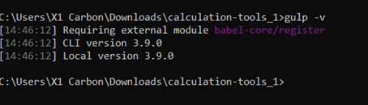
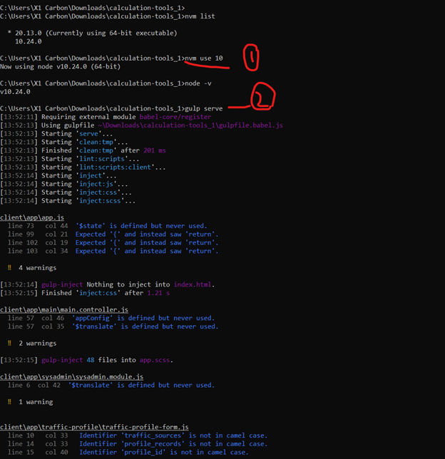
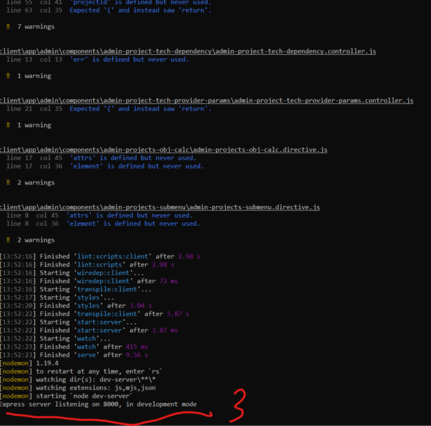

This guide provides step-by-step instructions for setting up the **old version of the Calculation Tools**, both on the client side and the server side.

There are 2 sides to this setup:

* **Client side setup** 
* **Server side setup** 

> GETTING STARTED :

**1. git clone https://ITUINT@dev.azure.com/ITUINT/ConnectivityToolkit/_git/calculation-tools**

---

## Client-Side Setup

Follow these steps to set up the client side of the project:

**Summary**

1. Navigate to project root.
2. Install required packages: `npm install && bower install`
3. Start application server: `gulp serve`

*For this to load successfully , ensure the following:*

### 1. Switch to Node.js Version 10

Ensure that Node.js version 10 is active in your environment:

<pre>

bash
<button class="flex gap-1 items-center"><svg xmlns="http://www.w3.org/2000/svg" width="24" height="24" fill="none" viewBox="0 0 24 24" class="icon-sm"><path fill="currentColor" fill-rule="evenodd" d="M7 5a3 3 0 0 1 3-3h9a3 3 0 0 1 3 3v9a3 3 0 0 1-3 3h-2v2a3 3 0 0 1-3 3H5a3 3 0 0 1-3-3v-9a3 3 0 0 1 3-3h2zm2 2h5a3 3 0 0 1 3 3v5h2a1 1 0 0 0 1-1V5a1 1 0 0 0-1-1h-9a1 1 0 0 0-1 1zM5 9a1 1 0 0 0-1 1v9a1 1 0 0 0 1 1h9a1 1 0 0 0 1-1v-9a1 1 0 0 0-1-1z" clip-rule="evenodd"></path></svg>Copy code</button>

<code class="!whitespace-pre hljs language-bash">nvm use 10
</code>

</pre>

### 2. Confirm the Active Node.js Version

Verify that Node.js version 10.x.x is active by running:

<pre>

bash
<button class="flex gap-1 items-center"><svg xmlns="http://www.w3.org/2000/svg" width="24" height="24" fill="none" viewBox="0 0 24 24" class="icon-sm"><path fill="currentColor" fill-rule="evenodd" d="M7 5a3 3 0 0 1 3-3h9a3 3 0 0 1 3 3v9a3 3 0 0 1-3 3h-2v2a3 3 0 0 1-3 3H5a3 3 0 0 1-3-3v-9a3 3 0 0 1 3-3h2zm2 2h5a3 3 0 0 1 3 3v5h2a1 1 0 0 0 1-1V5a1 1 0 0 0-1-1h-9a1 1 0 0 0-1 1zM5 9a1 1 0 0 0-1 1v9a1 1 0 0 0 1 1h9a1 1 0 0 0 1-1v-9a1 1 0 0 0-1-1z" clip-rule="evenodd"></path></svg>Copy code</button>

<code class="!whitespace-pre hljs language-bash">node -v
</code>

</pre>

Ensure the output shows `v10.x.x`.

### 3. Install Required Packages

Install the necessary packages for the project:

<pre>

bash
<button class="flex gap-1 items-center"><svg xmlns="http://www.w3.org/2000/svg" width="24" height="24" fill="none" viewBox="0 0 24 24" class="icon-sm"><path fill="currentColor" fill-rule="evenodd" d="M7 5a3 3 0 0 1 3-3h9a3 3 0 0 1 3 3v9a3 3 0 0 1-3 3h-2v2a3 3 0 0 1-3 3H5a3 3 0 0 1-3-3v-9a3 3 0 0 1 3-3h2zm2 2h5a3 3 0 0 1 3 3v5h2a1 1 0 0 0 1-1V5a1 1 0 0 0-1-1h-9a1 1 0 0 0-1 1zM5 9a1 1 0 0 0-1 1v9a1 1 0 0 0 1 1h9a1 1 0 0 0 1-1v-9a1 1 0 0 0-1-1z" clip-rule="evenodd"></path></svg>Copy code</button>

<code class="!whitespace-pre hljs language-bash">npm install && bower install
</code>

</pre>

### 4. Handling Gulp-Related Issues

If you encounter issues related to Gulp during installation, particularly with Babel and ES6, refer to the following guide to resolve them:

* [Using ES6 with Gulp](https://markgoodyear.com/2015/06/using-es6-with-gulp/)

You should be able to resolve the issues and proceed with development.

*After this fix( If you encounter it), confirm if gulp is set by typing **gulp -v***

### 5. Start the Development Server

Once everything is set up, start the development server using Gulp:

<pre>

bash
<button class="flex gap-1 items-center"><svg xmlns="http://www.w3.org/2000/svg" width="24" height="24" fill="none" viewBox="0 0 24 24" class="icon-sm"><path fill="currentColor" fill-rule="evenodd" d="M7 5a3 3 0 0 1 3-3h9a3 3 0 0 1 3 3v9a3 3 0 0 1-3 3h-2v2a3 3 0 0 1-3 3H5a3 3 0 0 1-3-3v-9a3 3 0 0 1 3-3h2zm2 2h5a3 3 0 0 1 3 3v5h2a1 1 0 0 0 1-1V5a1 1 0 0 0-1-1h-9a1 1 0 0 0-1 1zM5 9a1 1 0 0 0-1 1v9a1 1 0 0 0 1 1h9a1 1 0 0 0 1-1v-9a1 1 0 0 0-1-1z" clip-rule="evenodd"></path></svg>Copy code</button>

<code class="!whitespace-pre hljs language-bash">gulp serve
</code>

</pre>

### Important Notes:

* **Node Version** : Ensure that any new terminal you open for this project uses Node.js version 10.
* **Administrator Mode** : I recommend running CMD in administrator mode, especially if you're on Windows 11, to avoid permission issues.

---

**FRONT END SCREENSHOTS ( Check the numbering for illustrations and steps )**

---

*This part takes some bit of time, & you will encounter warnings and some light js errors, but let it process and load till the end*

 

## Server-Side Setup

Setting up the server side of the project involves configuring PHP and Python and running the necessary commands to start the local server.

**Summary** 

Required: Docker, Rabbitmq Recommended PHP version: *5.6.25+* Recommended NodeJS version: *7.9.0+* with NPM *4.2.0+*

Setting up PHP API server:

1. Navigate to **server** directory.
2. Install required packages: `php composer.phar install`
3. Start local server: `php composer.phar start`

  For this to load successfully , ensure the following:

### 1. Access the Server Directory

Open a new CMD terminal in administrator mode, and navigate to the server directory within the project:

<pre>

bash
<button class="flex gap-1 items-center"><svg xmlns="http://www.w3.org/2000/svg" width="24" height="24" fill="none" viewBox="0 0 24 24" class="icon-sm"><path fill="currentColor" fill-rule="evenodd" d="M7 5a3 3 0 0 1 3-3h9a3 3 0 0 1 3 3v9a3 3 0 0 1-3 3h-2v2a3 3 0 0 1-3 3H5a3 3 0 0 1-3-3v-9a3 3 0 0 1 3-3h2zm2 2h5a3 3 0 0 1 3 3v5h2a1 1 0 0 0 1-1V5a1 1 0 0 0-1-1h-9a1 1 0 0 0-1 1zM5 9a1 1 0 0 0-1 1v9a1 1 0 0 0 1 1h9a1 1 0 0 0 1-1v-9a1 1 0 0 0-1-1z" clip-rule="evenodd"></path></svg>Copy code</button>

<code class="!whitespace-pre hljs language-bash">cd path\to\your\project\server
</code>

</pre>

Example:

<pre>

bash
<button class="flex gap-1 items-center"><svg xmlns="http://www.w3.org/2000/svg" width="24" height="24" fill="none" viewBox="0 0 24 24" class="icon-sm"><path fill="currentColor" fill-rule="evenodd" d="M7 5a3 3 0 0 1 3-3h9a3 3 0 0 1 3 3v9a3 3 0 0 1-3 3h-2v2a3 3 0 0 1-3 3H5a3 3 0 0 1-3-3v-9a3 3 0 0 1 3-3h2zm2 2h5a3 3 0 0 1 3 3v5h2a1 1 0 0 0 1-1V5a1 1 0 0 0-1-1h-9a1 1 0 0 0-1 1zM5 9a1 1 0 0 0-1 1v9a1 1 0 0 0 1 1h9a1 1 0 0 0 1-1v-9a1 1 0 0 0-1-1z" clip-rule="evenodd"></path></svg>Copy code</button>

<code class="!whitespace-pre hljs language-bash">C:\Users\X1 Carbon\Downloads\calculation-tools_1>cd server
</code>

</pre>

### 2. Confirm Versions

Before proceeding, ensure that the following versions are active:

* **PHP Version** : At least 7.3. I am using PHP 8.1.12 because it comes with the XAMPP application I am running. You can download XAMPP from [Apache Friends](https://www.apachefriends.org/download.html).
* **Python Version** : For this project, it should be Python 2.7. You can download it from [Python.org](https://www.python.org/downloads/release/python-272/).
* **Node.js Version** : Ensure you are using Node.js version 10.24.0. Gulp is also required.

### 3. Install Required Packages

Install the necessary packages for the server side using Composer:

<pre>

bash
<button class="flex gap-1 items-center"><svg xmlns="http://www.w3.org/2000/svg" width="24" height="24" fill="none" viewBox="0 0 24 24" class="icon-sm"><path fill="currentColor" fill-rule="evenodd" d="M7 5a3 3 0 0 1 3-3h9a3 3 0 0 1 3 3v9a3 3 0 0 1-3 3h-2v2a3 3 0 0 1-3 3H5a3 3 0 0 1-3-3v-9a3 3 0 0 1 3-3h2zm2 2h5a3 3 0 0 1 3 3v5h2a1 1 0 0 0 1-1V5a1 1 0 0 0-1-1h-9a1 1 0 0 0-1 1zM5 9a1 1 0 0 0-1 1v9a1 1 0 0 0 1 1h9a1 1 0 0 0 1-1v-9a1 1 0 0 0-1-1z" clip-rule="evenodd"></path></svg>Copy code</button>

<code class="!whitespace-pre hljs language-bash">php composer.phar install
</code>

</pre>

### 4. Start the Local Server

Once the packages are installed, start the local server:

<pre>

bash
<button class="flex gap-1 items-center"><svg xmlns="http://www.w3.org/2000/svg" width="24" height="24" fill="none" viewBox="0 0 24 24" class="icon-sm"><path fill="currentColor" fill-rule="evenodd" d="M7 5a3 3 0 0 1 3-3h9a3 3 0 0 1 3 3v9a3 3 0 0 1-3 3h-2v2a3 3 0 0 1-3 3H5a3 3 0 0 1-3-3v-9a3 3 0 0 1 3-3h2zm2 2h5a3 3 0 0 1 3 3v5h2a1 1 0 0 0 1-1V5a1 1 0 0 0-1-1h-9a1 1 0 0 0-1 1zM5 9a1 1 0 0 0-1 1v9a1 1 0 0 0 1 1h9a1 1 0 0 0 1-1v-9a1 1 0 0 0-1-1z" clip-rule="evenodd"></path></svg>Copy code</button>

<code class="!whitespace-pre hljs language-bash">php composer.phar start
</code>

</pre>

### Notes:

* **Errors and Warnings** : You may encounter a long list of errors and warnings during the server startup, but the server should still run successfully.

---

**SCREENSHOTS :** 

This part takes some bit of time, & you will encounter warnings and some light js errors, but let it process and load till the end

---

